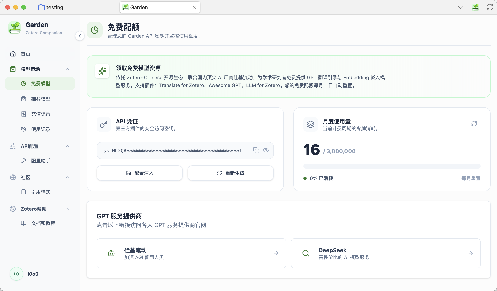
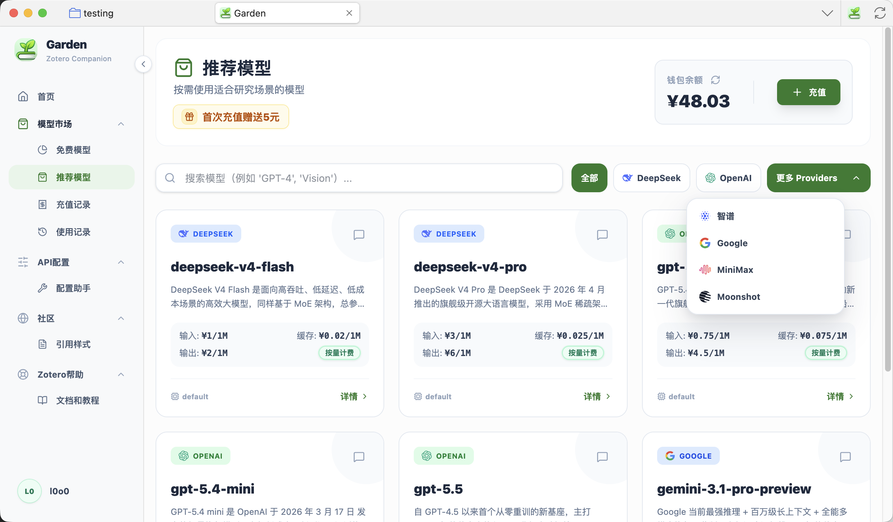
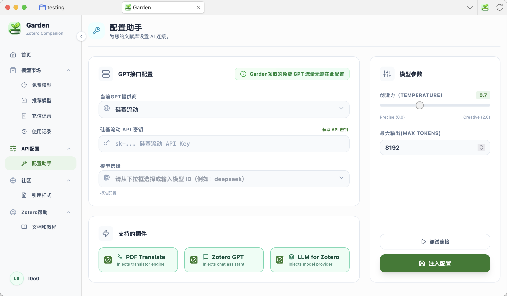
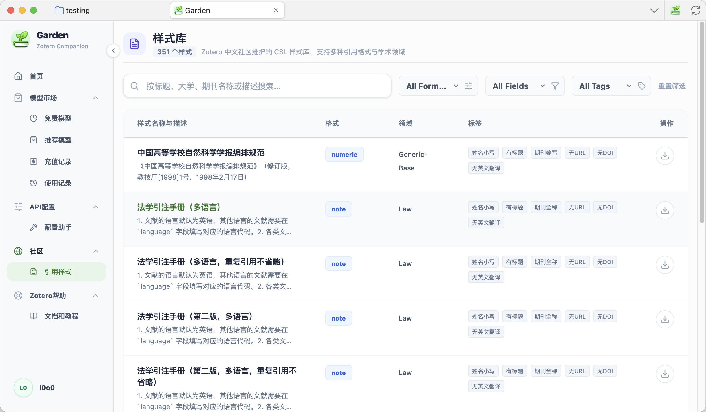
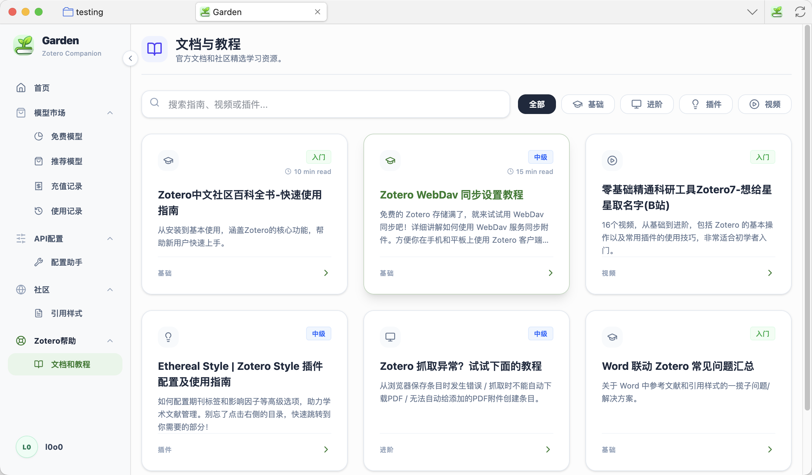

# Garden for Zotero - 发布版本

专为中国宝宝研制的 Zotero 插件发布仓库。

## 📦 安装方法

1. 下载最新的 `garden_{version}.xpi` 文件
2. 打开 Zotero，进入 Tools → Add-ons
3. 点击右上角齿轮图标，选择 "Install Add-on From File..."
4. 选择下载的 `garden_{version}.xpi` 文件安装

## ✨ 主要功能

- 🔐 用户认证系统
- 🎁 免费大模型，开箱即用，可作为免费翻译服务
- 🤖 全球顶尖大模型 API 集成，支持多个 Zotero 插件生态
- 📊 Token 使用统计
- 🛠️ 配置自动注入支持
- 🎓 Zotero 中文社区资源快速获取

**免费模型**
支持 Translate for Zotero（作为免费翻译引擎）， Awesome GPT 和 LLM for Zotero

**推荐模型，在Zotero中快速接入全球顶尖大模型**
现在你可以在 Garden 的推荐模型列表中，快速将国内外的顶尖模型一键配置到 Zotero 插件中，无效复杂手动配置。

**API配置工具**
支持国内外多家大模型接口提供商，包括 硅基流动，DeepSeek、阿里百炼、字节、小米、MiniMax、Kimi，Google，OpenAI等

**中文社区CSL资源下载**
与 https://zotero-chinese.com/styles/ 网站同步更新 CSL 样式文件，支持查询和下载，让你不必离开 Zotero 就能快速下载样式文件。

**Zotero帮助文档**
精选全网的 Zotero 教程文档和视频，让你快速入门，精通 Zotero 使用。

## 🔗 支持的插件

- [Translate for Zotero](https://github.com/windingwind/zotero-pdf-translate/) - PDF 翻译
- [Awesome GPT](https://github.com/MuiseDestiny/zotero-gpt) - GPT 助手
- [LLM for Zotero](https://github.com/yilewang/llm-for-zotero) - AI 智能研究助手
